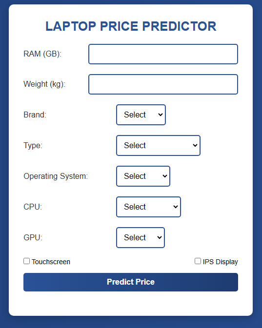

# Laptop Price Predictor

## Overview
This project is a **Laptop Price Predictor** web application built using **Flask**. It utilizes a machine learning model to predict the price of a laptop based on various features such as RAM, weight, brand, CPU, GPU, and more.

## UI Preview



## Features
- Predicts laptop prices based on user input.
- Web interface built with HTML, CSS, and Flask.
- Machine learning model trained using historical laptop data.
- Uses **Pickle** for model storage and loading.

## Technologies Used
- **Python** (Flask, NumPy, Pandas, Pickle)
- **HTML, CSS** (Frontend styling)
- **Jupyter Notebook** (Model training & evaluation)

## Project Structure
```
├── model building.ipynb   # Jupyter Notebook for training the model
├── model/
│   ├── predictor.pickle   # Trained model file
├── static/
│   ├── style.css         # Styling for the web app
├── templates/
│   ├── index.html        # Frontend HTML file
├── app.py                 # Flask application backend
├── README.md              # Project documentation
```

## Setup & Installation
1. **Clone the repository:**
   ```bash
   git clone <repository-url>
   cd laptop-price-predictor
   ```
2. **Create a virtual environment (optional but recommended):**
   ```bash
   python -m venv venv
   source venv/bin/activate  # On Windows: venv\Scripts\activate
   ```
3. **Install dependencies:**
   ```bash
   pip install -r requirements.txt
   ```
4. **Run the Flask application:**
   ```bash
   python app.py
   ```
5. Open your browser and go to `http://127.0.0.1:5000/` to use the app.

## Usage
- Enter laptop specifications such as RAM, weight, brand, CPU, and GPU.
- Click the **Predict** button.
- The predicted price will be displayed.

## Model Training
The `model building.ipynb` notebook contains the steps for training the machine learning model using a dataset of laptops. The trained model is saved as `predictor.pickle` and used for predictions in the Flask app.

## Dependencies
Ensure you have the following libraries installed:
```bash
Flask
NumPy
Pandas
scikit-learn
Pickle
```

## Future Improvements
- Improve model accuracy with advanced ML techniques.
- Add support for more laptop features.
- Enhance UI with better user experience.

## License
This project is open-source and available under the MIT License.

---
Developed by **Charutha Pawan Kodikara** 🚀

